 

I build web apps from the API to the interface. Mostly **Java + TypeScript**, with a soft spot for developer tools and making complicated workflows feel simple.

### My stack

Also working with **Vite**, **Playwright**, **Postman** and **Groq**.

### On my desk

| Project | What I'm building |
| :--- | :--- |
| **Neurodive** | A React and TypeScript frontend for resources, professional discovery, memberships and admin workflows. |
| **codeGraph** | Dependency maps for JavaScript and TypeScript: what a change affects, what tests cover, and what the analyzer couldn't resolve. |

Most of my code lives in private repositories. This is a glimpse of what I'm working on.

### Meanwhile, in the commit history

<picture>
  <source media="(prefers-color-scheme: dark)" srcset="https://raw.githubusercontent.com/imranelak1/imranelak1/output/github-contribution-grid-snake-dark.svg" />
  <source media="(prefers-color-scheme: light)" srcset="https://raw.githubusercontent.com/imranelak1/imranelak1/output/github-contribution-grid-snake.svg" />
  
</picture>
